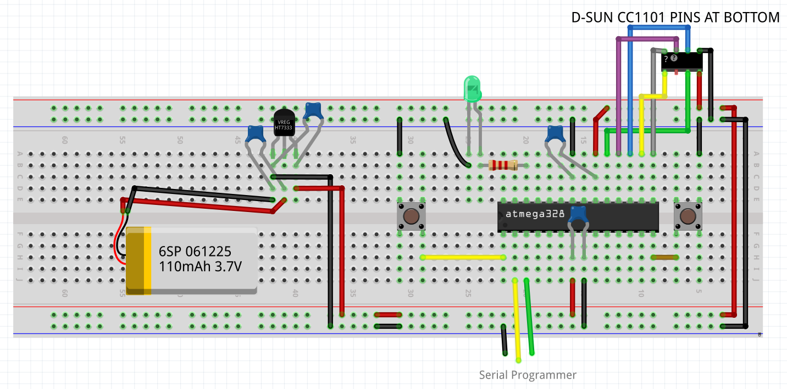

The sketches can be opened with platformio as separate projects and the C1101 library
will be loaded automatically.

The "ping" example presents the most useful functions of the library.

The "pingLowPower" example utilizes WoR mode on CC1101 and sleep_mode_power_down on atmega328p.

Here is a breadboard circuit. It can be used with both "ping" and "pingLowPower". If you want to see very low current consumption you will need a very low quiescent current voltage regulator, the best I
found are HT7333 and MCP1700-3.3

